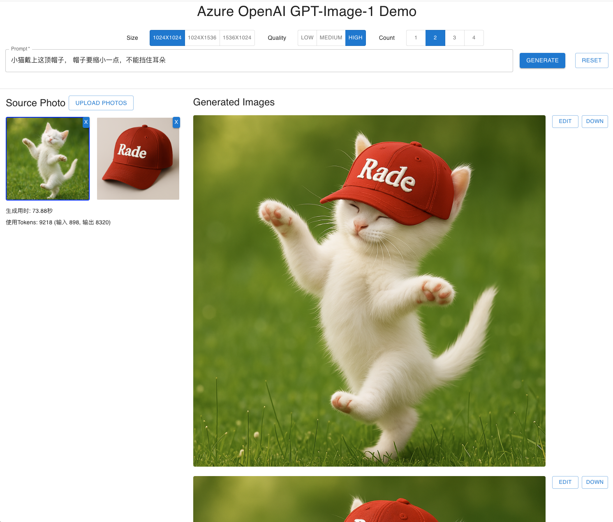

# GPT-Image-1 Demo

这是一个使用 Azure OpenAI Image API 的交互式图像生成与编辑示例项目。
- 参考
    - https://learn.microsoft.com/en-us/azure/ai-services/openai/how-to/dall-e?tabs=gpt-image-1
    - [Azure OpenAI Image API 文档](https://learn.microsoft.com/en-us/azure/ai-services/openai/reference-preview)


## 特性

- React 前端（`frontend/src/App.js`）直连 Azure OpenAI Image 接口
- TypeScript + Express 后端（`server.ts`）统一提供静态资源与 API
- 生成和编辑的图片自动保存到项目根 `img/` 目录
- 单个服务进程同时提供前端页面、API 路由和静态资源

## 环境需求

- Node.js (>=14)
- npm 或 yarn
- Azure OpenAI 访问凭证

## 环境变量
在项目根创建 `.env`，添加：

```dotenv
AZURE_OPENAI_ENDPOINT=<你的 Azure OpenAI 端点 URL>
AZURE_OPENAI_KEY=<你的 Azure OpenAI API Key>
REACT_APP_AZURE_OPENAI_ENDPOINT=${AZURE_OPENAI_ENDPOINT}
REACT_APP_AZURE_OPENAI_KEY=${AZURE_OPENAI_KEY}
```  

如果仅前端使用环境变量，请在 `frontend/.env` 添加：
```
REACT_APP_AZURE_OPENAI_ENDPOINT=${AZURE_OPENAI_ENDPOINT}
REACT_APP_AZURE_OPENAI_KEY=${AZURE_OPENAI_KEY}
```

## 安装与构建

```bash
# 安装根依赖
npm ci

# 构建前端 & 编译后端
npm run build
``` 

## 启动服务

```bash
npm start
```  
服务启动后访问 http://localhost:5005 即可。

## 脚本说明

- `npm run build:client`：安装并构建 React 前端
- `npm run build:server`：使用 `tsc` 编译 TypeScript 后端
- `npm run build`：先前端再后端打包
- `npm start`：运行编译后的 `dist/server.js`

## 图片存储

生成和编辑后的所有图片会保存在项目根 `img/` 目录

## 测试

使用 `test.http` 中的示例 HTTP 请求测试 `/api/generate` 和 `/api/edit` 接口。

---  

2025年4月27日  by GPT-Image Demo